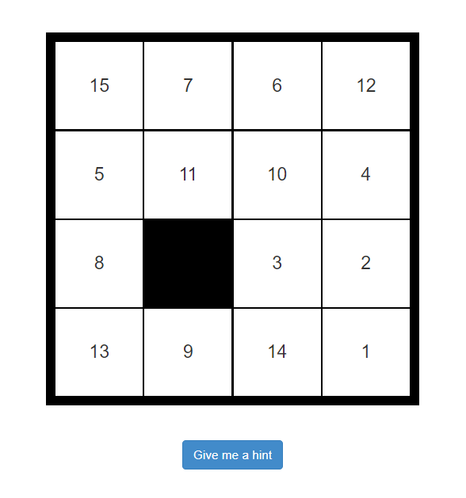

# Simple puzzle re-arranging game

## How to play

1. Click on a cell next to the empty one to change the position of cells
2. Keep going until they are numbered 1-15, with the empty one at the end.

## Code

- Javascript only
- HTML + CSS for decoration
- *using webpack to run the server* with command `webpack-dev-server`

***Note:***

Remove the comments on lines 14-36 on `index.html` and comment lines 3-28 on `puzzle.js` and 34 on `index.html` to get a quick easy win.
